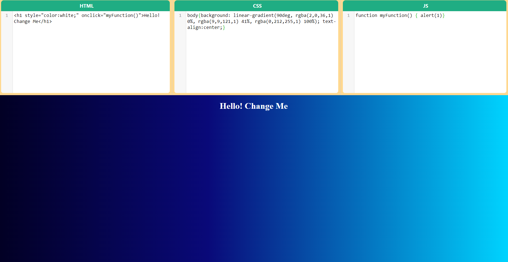

# Collaborative Web Development - Backend Spring Boot

### Tech Stack

**Netty Socket IO:** socket server

**MongoDB**: document based nosql db

**Docker:** container technology

&nbsp;

### How to run

#### clone the project: https://github.com/gurkanucar/collaborative-web-be

```bash
  git clone https://github.com/gurkanucar/collaborative-web-be
```

#### create jar

```bash
  mvn clean install -DskipTests
```

#### build docker-compose

```bash
  docker-compose build --no-cache
```

#### run docker-compose

```bash
  docker-compose up --force-recreate
```

## Example Images




### Example Video:

[https://www.youtube.com/watch?v=_BSXmWHKGEo](https://www.youtube.com/watch?v=_BSXmWHKGEo)

### Frontend:

[https://github.com/gurkanucar/collaborative-web-fe](https://github.com/gurkanucar/collaborative-web-fe)